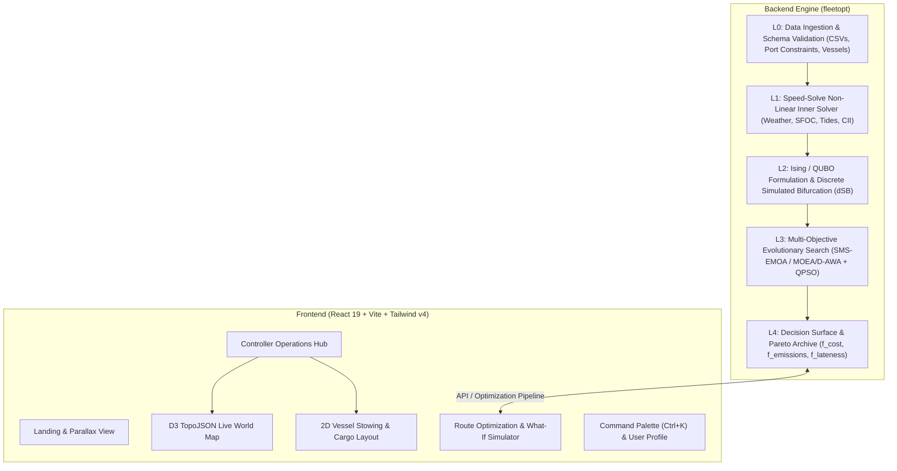

# ⚓ Green Fleet Optimizer

[](https://vitejs.dev/)
[](https://react.dev/)
[](https://www.typescriptlang.org/)
[](https://www.python.org/)
[](https://tailwindcss.com/)
[](#license)

**Green Fleet Optimizer** is an end-to-end maritime fleet deployment, speed profiling, and route optimization platform. It combines a **quantum-inspired bilevel multi-objective optimization engine** with a **high-fidelity controller operations interface** to achieve IMO 2030/2050 decarbonization targets, optimize bunker costs, and ensure strict schedule reliability under real-world maritime constraints.

---

## 📑 Table of Contents

- [Overview & Problem Statement](#-overview--problem-statement)
- [System Architecture](#-system-architecture)
- [Repository Structure](#-repository-structure)
- [Key Features](#-key-features)
  - [Frontend: Controller Dashboard](#frontend-controller-operations-platform)
  - [Backend: Optimization Engine](#backend-quantum-inspired-optimization-engine)
- [Getting Started](#-getting-started)
  - [Prerequisites](#prerequisites)
  - [Frontend Setup](#frontend-setup)
  - [Backend Setup](#backend-setup)
- [Running Demos & Benchmarks](#-running-demos--benchmarks)
- [Mathematical Formulation & Objectives](#-mathematical-formulation--objectives)
- [Datasets & Pre-trained Models](#-datasets--pre-trained-models)
- [Testing](#-testing)
- [License](#-license)

---

## 🌊 Overview & Problem Statement

Commercial maritime shipping accounts for nearly 3% of global greenhouse gas emissions. Maritime operators face stringent International Maritime Organization (IMO) regulations (CII — Carbon Intensity Indicator and EEXI — Energy Efficiency Existing Ship Index), volatile fuel prices, and complex port logistical bottlenecks (tidal windows, berth congestion, and draft restrictions).

Green Fleet Optimizer formulates this challenge as a **bilevel multi-objective optimization problem**:
1. **Master Problem (Discrete Routing & Allocation)**: Solved using Ising Hamiltonian / QUBO formulations accelerated by Discrete Simulated Bifurcation (dSB) and evolutionary multi-objective heuristics.
2. **Inner Problem (Continuous Non-linear Speed & Bunkering)**: Computes optimal vessel speed profiles, fuel consumption, weather-adjusted sea margins, and tide-window synchronization.
3. **Operations Controller Platform**: Provides fleet operators, dispatchers, and captains with real-time tracking, 2D vessel and cargo bay stowing layouts, what-if scenario simulations, and automated reporting.

---

## 🏛 System Architecture



---

## 📁 Repository Structure

```
Green-Fleet-Optimizer/
│
├── frontend/                                   # Modern React 19 + Vite operations interface
│   ├── public/                                 # Static assets & animation sequence frames
│   │   └── sequence/                           # High-resolution parallax frame sequences
│   ├── src/
│   │   ├── components/
│   │   │   ├── captain/                        # Captain's voyage dashboard & live status
│   │   │   ├── controller/                     # Dispatcher control center
│   │   │   │   ├── CaptainAssignment.tsx       # Crew & captain scheduling
│   │   │   │   ├── CargoLayout.tsx             # Cargo container management
│   │   │   │   ├── ControllerDashboard.tsx     # Central metric overviews & quick actions
│   │   │   │   ├── FleetManagement.tsx         # Fleet vessel inspection & parameters
│   │   │   │   ├── FleetOverview.tsx           # Global fleet KPIs and active voyages
│   │   │   │   ├── FleetSchedule.tsx           # Gantt timeline & ETA projections
│   │   │   │   ├── LiveMap.tsx                 # Interactive D3 world map with ship routes
│   │   │   │   ├── OrdersFlow.tsx              # Cargo order intake & assignment
│   │   │   │   ├── RouteOptimization.tsx       # Waypoint, weather, & bunker selection
│   │   │   │   ├── TerminalHeader.tsx          # Real-time port terminal weather & status
│   │   │   │   ├── VesselDashboard.tsx         # Individual vessel telemetry
│   │   │   │   ├── VesselLayout2D.tsx          # 2D cross-section container stowing visualizer
│   │   │   │   └── WhatIfAnalysis.tsx          # Fuel price & weather delay scenario testing
│   │   │   └── ui/                             # UI components (CommandSearch, EditProfile, etc.)
│   │   ├── data/                               # Sample fleet, orders, and world map data
│   │   ├── index.css                           # Tailwind CSS v4 styling & design tokens
│   │   └── main.tsx                            # React root entrypoint
│   ├── package.json                            # Frontend dependencies & scripts
│   ├── tsconfig.json                           # TypeScript configuration
│   └── vite.config.ts                          # Vite build & plugin settings
│
├── backend/                                    # Quantum-inspired Python optimization suite
│   ├── fleetopt/
│   │   ├── benchmark/                          # Standard test problems (ZDT1-6, DTLZ) & metrics
│   │   │   ├── indicators.py                   # Hypervolume (HV), Spacing, Spread, IGD+
│   │   │   ├── runner.py                       # Automated multi-seed benchmark execution
│   │   │   └── standard_ops.py                 # Multi-algorithm comparative harness
│   │   ├── inner/                              # Inner-loop optimization
│   │   │   └── speed_solve.py                  # Non-linear speed & fuel optimization
│   │   ├── io/                                 # Data loaders and schema models
│   │   │   ├── loader.py                       # CSV parser and dataset preprocessor
│   │   │   └── schema.py                       # Dataclasses & operational validation
│   │   ├── master/                             # Master allocation & QUBO solver
│   │   │   ├── dsb.py                          # Discrete Simulated Bifurcation algorithm
│   │   │   ├── option_gen.py                   # Feasible route and bunker option generation
│   │   │   └── qubo.py                         # Ising Hamiltonian matrix construction
│   │   ├── model/                              # Maritime domain models
│   │   │   ├── emissions.py                    # Fuel-to-CO2 conversion, CII ratings, EEXI
│   │   │   ├── network.py                      # Maritime leg network graph
│   │   │   └── ports.py                        # Port congestion, berth times, tide windows
│   │   ├── outer/                              # Outer-loop multi-objective metaheuristics
│   │   │   ├── archive.py                      # Pareto non-dominated archive & knee detection
│   │   │   ├── moead_awa.py                    # MOEA/D with Adaptive Weight Adjustment
│   │   │   ├── qpso.py                         # Quantum-behaved Particle Swarm variation
│   │   │   └── sms_emoa.py                     # S-Metric Selection EMOA (Hypervolume-driven)
│   │   └── repair/                             # Feasibility enforcement
│   │       └── decoder.py                      # Chromosome decoder & repair operator
│   ├── data/                                   # Operational benchmark CSV datasets
│   │   ├── bunker_availability_price.csv       # Multi-port fuel prices (VLSFO, MGO, LNG)
│   │   ├── cargo_parcels.csv                   # Cargo parcels, deadlines, and requirements
│   │   ├── legs.csv                            # Sea lanes, distances, and ECA boundaries
│   │   ├── ports.csv                           # Coordinates, draft limits, and handling rates
│   │   ├── tide_windows.csv                    # Tidal height limits by timestamp
│   │   ├── vessels.csv                         # Fleet specifications, DWT, and engine curves
│   │   └── weather_forecast.csv                # Significant wave height and wind head/tail
│   ├── figures/                                # Generated Pareto fronts & convergence plots
│   ├── results/                                # Execution logs and JSON benchmark results
│   ├── scripts/                                # CLI runners for demos and ablation studies
│   ├── tests/                                  # Pytest suite
│   ├── requirements.txt                        # Python dependencies
│   └── README.md                               # Backend documentation
│
├── .gitignore                                  # Comprehensive monorepo gitignore
├── .gitattributes                              # Git LFS definitions for model weights & media
└── README.md                                   # Root documentation
```

---

## 🚀 Key Features

### Frontend: Controller Operations Platform
- **Global Fleet Radar**: Real-time position tracking over D3 TopoJSON world map projections with maritime shipping corridors.
- **2D Vessel Stowing Visualizer**: Interactive container bay stowing representation displaying cargo weight distribution and stability checks.
- **Route & Speed Profiler**: Visual leg-by-leg waypoint breakdown showing fuel burn rates, speed over ground, and weather impact.
- **What-If Scenario Sandbox**: On-the-fly simulation of bunker price spikes, port strikes, and weather disruptions.
- **Quick Command Center**: Keyboard-driven modal palette (`Ctrl + K` / `Cmd + K`) for instant navigation and vessel search.
- **Captain & Crew Scheduler**: Automated duty allocation adhering to maritime labor conventions and vessel compatibility.

### Backend: Quantum-Inspired Optimization Engine
- **Hardware-Ready QUBO Construction**: Formulates parcel-to-vessel assignment as an Ising Hamiltonian, compatible with classical simulators or quantum hardware (D-Wave, IBM, Fujitsu Digital Annealer).
- **Discrete Simulated Bifurcation (dSB)**: Solves large-scale combinatorial assignment problems via non-linear oscillator network integration.
- **Hypervolume-Driven Multi-Objective Search (SMS-EMOA & MOEA/D-AWA)**: Produces uniform Pareto frontiers balancing operational cost, carbon emissions, and transit lateness.
- **Quantum-Behaved PSO (QPSO)**: Explores continuous decision spaces using wave-function-derived delta potential well sampling.
- **Non-Linear Speed-Solve Inner Loop**: Optimizes cubic/polynomial engine power curves, hydrodynamic resistance, and tidal gate constraints.
- **IMO CII & EEXI Compliance Engine**: Evaluates annual operational carbon intensity ratings (A through E).

---

## ⚡ Getting Started

### Prerequisites
- **Node.js**: `v18.0.0` or later (Node 20+ recommended)
- **pnpm** or **npm**
- **Python**: `3.10` or later
- **Git** with **Git LFS** enabled:
  ```bash
  git lfs install
  ```

### Repository Setup
```bash
git clone https://github.com/Spiiny/Green-Fleet-Optimizer.git
cd Green-Fleet-Optimizer
```

---

### Frontend Setup

1. **Navigate to the frontend folder**:
   ```bash
   cd frontend
   ```

2. **Install dependencies**:
   ```bash
   npm install
   ```

3. **Start the local development server**:
   ```bash
   npm run dev
   ```
   Open [http://localhost:5173](http://localhost:5173) in your browser.

4. **Build for production**:
   ```bash
   npm run build
   ```

---

### Backend Setup

1. **Navigate to the backend folder**:
   ```bash
   cd backend
   ```

2. **Create and activate a virtual environment**:
   ```bash
   # Windows (PowerShell)
   python -m venv .venv
   .\.venv\Scripts\activate

   # macOS / Linux
   python3 -m venv .venv
   source .venv/bin/activate
   ```

3. **Install dependencies**:
   ```bash
   pip install -r requirements.txt
   ```

4. **Verify installation**:
   ```bash
   pytest
   ```

---

## 🔬 Running Demos & Benchmarks

The backend includes reproducible demonstration and benchmark scripts:

```bash
# 1. Routing + Repair + Inner Speed Solver demo
python scripts/demo_m2.py

# 2. Options -> QUBO -> dSB solver comparison vs Business-As-Usual (BAU)
python scripts/demo_m4.py

# 3. Generate the full multi-objective Pareto front
python scripts/demo_m5.py --quick

# 4. Standard maritime benchmark comparison vs pymoo baselines
python scripts/demo_m6.py --quick

# 5. Component ablation study (identifying algorithmic contributions)
python scripts/ablation.py

# 6. Standard synthetic benchmark suite (ZDT1-ZDT6, DTLZ)
python scripts/benchmark_standard.py --seeds=15

# 7. Scalability probe evaluating dSB payoff across problem sizes
python scripts/scaling_probe.py --sizes=24,48,96
```

---

## 📐 Mathematical Formulation & Objectives

The optimization engine simultaneously minimizes three conflicting objectives:

$$\min_{x \in \mathcal{X}} \mathbf{F}(x) = \begin{bmatrix} f_{\text{cost}}(x) \\ f_{\text{emissions}}(x) \\ f_{\text{lateness}}(x) \end{bmatrix}$$

1. **Fuel & Operational Cost ($f_{\text{cost}}$)**:
   $$f_{\text{cost}} = \sum_{v \in \mathcal{V}} \sum_{l \in \mathcal{L}_v} \left( P_{\text{fuel}}(v, l) \cdot C_{\text{bunker}}(l) + C_{\text{port}}(l) + C_{\text{charter}}(v) \cdot T(v, l) \right)$$

2. **Total Greenhouse Gas Emissions ($f_{\text{emissions}}$)**:
   $$f_{\text{emissions}} = \sum_{v \in \mathcal{V}} \sum_{l \in \mathcal{L}_v} P_{\text{fuel}}(v, l) \cdot C_{F} \cdot (1 + \delta_{\text{weather}}(l))$$
   *(where $C_F$ is the IMO fuel-to-CO2 conversion factor: $3.114\text{ t-CO}_2/\text{t-fuel}$ for HFO/VLSFO, $3.206$ for MGO, $2.750$ for LNG).*

3. **Schedule Lateness & Demurrage ($f_{\text{lateness}}$)**:
   $$f_{\text{lateness}} = \sum_{p \in \mathcal{P}} \max(0, T_{\text{arrival}}(p) - T_{\text{deadline}}(p))$$

Subject to:
- **Cargo-vessel capacity and compatibility constraints**
- **Port draft limitations vs vessel displacement**
- **Tidal arrival/departure time windows**
- **Emission Control Area (ECA) sulfur cap limits**
- **One Way Traffic and traffic regulation**

---

## 📊 Datasets & Pre-trained Models

- **Data Tables (`backend/data/` and `frontend/src/data/`)**:
  - `ports.csv`: Global container & bulk terminals with draft and coordinates.
  - `vessels.csv`: Fleet technical particulars, deadweight, and fuel consumption coefficients.
  - `legs.csv`: Maritime shipping lanes, distances, and ECA zone flags.
  - `tide_windows.csv`: Port tide height predictions.
  - `bunker_availability_price.csv`: Bunker prices for VLSFO, MGO, and LNG.
  - `weather_forecast.csv`: Wave heights, current, and wind resistance factors.
- **Deep Learning ETA & Demand Weights (`frontend/models/`)**:
  - `eta_lstm_model.pth`: Pre-trained LSTM predicting vessel arrival times given AIS history and weather.
  - `plant_demand_lstm_model.pth`: Port throughput and plant cargo demand forecaster.
  - `fuel-consumption.pth`: Neural surrogate model for vessel speed-fuel non-linear curves.

---

## 🧪 Testing

Run backend tests using `pytest`:
```bash
cd backend
pytest -v
```

All 21 test suites validate:
- Master QUBO matrix generation and energy evaluations
- Outer-loop Pareto archiving and hypervolume calculations
- Feasibility repair decoders for cargo assignments
- Speed-solve non-linear profile convergence
- Data loading and schema integrity

---

## 📄 License

Proprietary. All rights reserved. Developed for maritime green fleet operations and smart logistics optimization.
